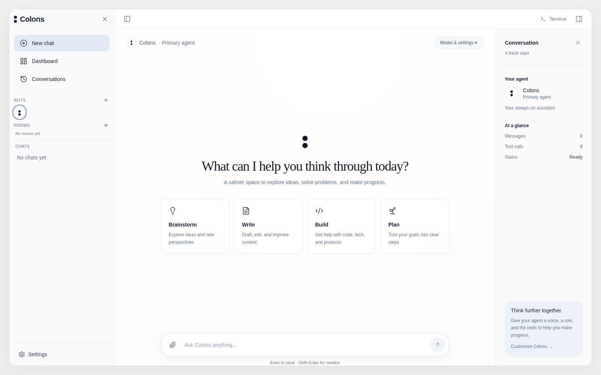

# Colons

**v0.0.1 beta** · A self-hosted AI assistant workspace.

[](https://github.com/kyssta-exe/colons/actions/workflows/ci.yml)
[](LICENSE)

Colons gives your model a workspace: clean chat, named agents, shared rooms, file and
browser tools, memory, scheduled work, and messaging through Telegram, Discord, and Slack.
Bring an API provider, an OpenAI-compatible endpoint, or a local model through Ollama.
Colons keeps its own assistant identity while reporting the model you choose.



## Install and run

Requires **Python 3.10+**, **Node.js 20+ with npm**, and Git on Linux, macOS, or Windows
with WSL2. The installer creates a virtual environment and builds the web UI.

```bash
git clone https://github.com/kyssta-exe/colons.git
cd colons
./scripts/install.sh
./scripts/run.sh
```

Open **http://127.0.0.1:8000**. Stop the server with Ctrl+C. Start it again with
`./scripts/run.sh`; you do not need to reinstall.

The default provider is Ollama. With Ollama running locally, pull a model before chatting:

```bash
ollama pull llama3.1
```

For another provider, copy the sample configuration and edit it before starting:

```bash
cp colons/.env.example colons/.env
# Set COLONS_PROVIDER, COLONS_API_KEY, COLONS_MODEL, and optionally COLONS_BASE_URL.
./scripts/run.sh
```

The run script loads `colons/.env`; quote values containing spaces. Never commit credentials.
You can also use Settings → Models for runtime changes. Those model settings reset on restart;
use the environment file or `colons/colons.yaml` to keep them permanently.

If Chromium reports missing Linux libraries, install its system dependencies:

```bash
colons/.venv/bin/python -m playwright install --with-deps chromium
```

See [installation and configuration](docs/installation.md) for custom endpoints, Docker,
wheel installation, updating, and troubleshooting.

## What you can do

- Chat with streaming replies, image/text attachments, and saved conversations.
- Create named bots, assign roles, and work together in shared rooms.
- Create, edit, and read workspace files; execute commands; use a native Chromium browser.
- Choose Auto, Approval, or Full access in Settings → Permissions. The default persists.
- Review token bars, tool activity, background tasks, schedules, and diagnostics.
- Configure Telegram, Discord, and Slack directly in Settings → Messaging.

Permissions apply to available tools; file tools stay in the configured workspace.
Shell commands use the server account's access. Run Colons locally, or configure server
authentication before exposing it beyond your machine. This beta uses shared server API
keys rather than a complete multi-user authentication system.

Sessions, memories, bots, rooms, schedules, messaging setup, and permission defaults persist.
Tasks and usage totals are currently in memory. Browser sessions do not survive restart.
Uploads support images and text/code/data files; PDF and office-document extraction are future work.

## Docker

```bash
cd colons
docker compose up -d --build
docker compose exec ollama ollama pull llama3.1
```

Open http://127.0.0.1:8000. The default Compose stack includes Ollama and stores application
and model data in named volumes. See [Docker configuration](docs/installation.md#docker).

## Develop and contribute

```bash
./scripts/install.sh --dev
source colons/.venv/bin/activate
make test
make lint
make web
```

[Contributing](CONTRIBUTING.md) covers the source layout, checks, UI smoke tests, and release builds.
GitHub Actions runs Python checks, builds the UI and Python distributions, and checks native
browser and chat interactions. Version tags trigger the release workflow; wheels include the UI.

The maintained application is in [`colons/`](colons/). Other root-level application folders
are an earlier prototype kept for reference. Use the root install/run scripts or the active
application's [CLI and API reference](colons/README.md).

Licensed under [MIT](LICENSE).
